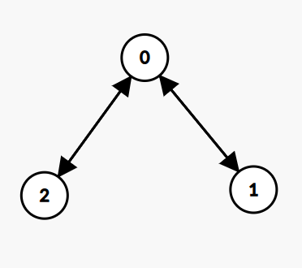

graph 

Graph is a data structure in which there are some nodes (vertices), and there are connections (edges) between them.

graph vs tree

1) Multiple edge 

Graphs may have multiple edges , but trees do not allow multiple edges between the same nodes.

